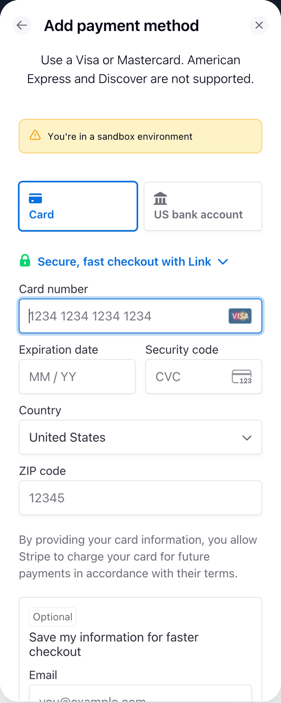
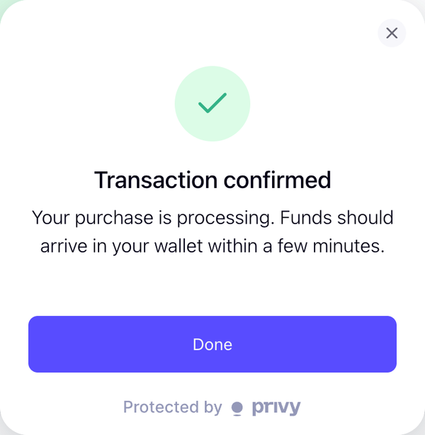
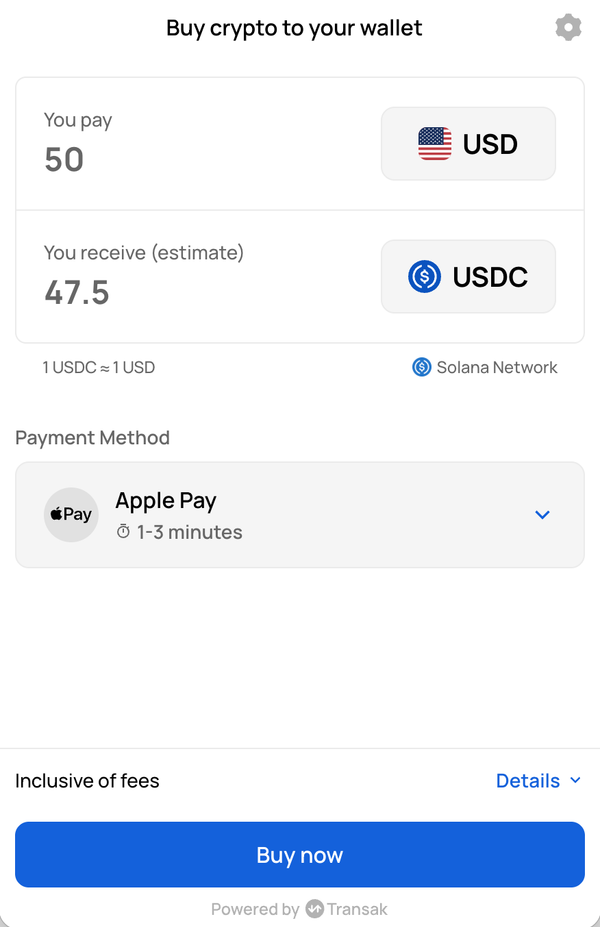

# Local funding sandbox evidence

Manually tested from the local frontend on September 29, 2026, using USDC on Solana. These screenshots were cropped to the checkout UI to remove browser chrome, personal information, wallet details, and URL parameters. They show sandbox behavior and do not demonstrate mainnet settlement or geographic coverage.

| Flow | Observed result |
| --- | --- |
| Stripe Embedded Components | Completed Link verification, identity verification, test-card entry, approval, and the transaction confirmation screen; returned to the app. |
| Meld → Transak | Opened Transak's staging checkout for a $50 USD purchase of USDC on Solana. Purchase completion remains untested. |

## Stripe payment entry

The embedded payment form identifies the sandbox environment and offers card and US bank account payment methods.

## Stripe confirmation

The local Stripe sandbox test reached the transaction confirmation screen.

## Meld provider checkout

Meld routed the local test to Transak's staging checkout. Transak branding is expected because Meld aggregates providers. This screenshot shows the checkout handoff, not a completed purchase.

See the [funding setup and test instructions](../../../README.md#funding-wallets) to reproduce these flows. Manual Base checkout and a completed Meld sandbox purchase remain outstanding.
